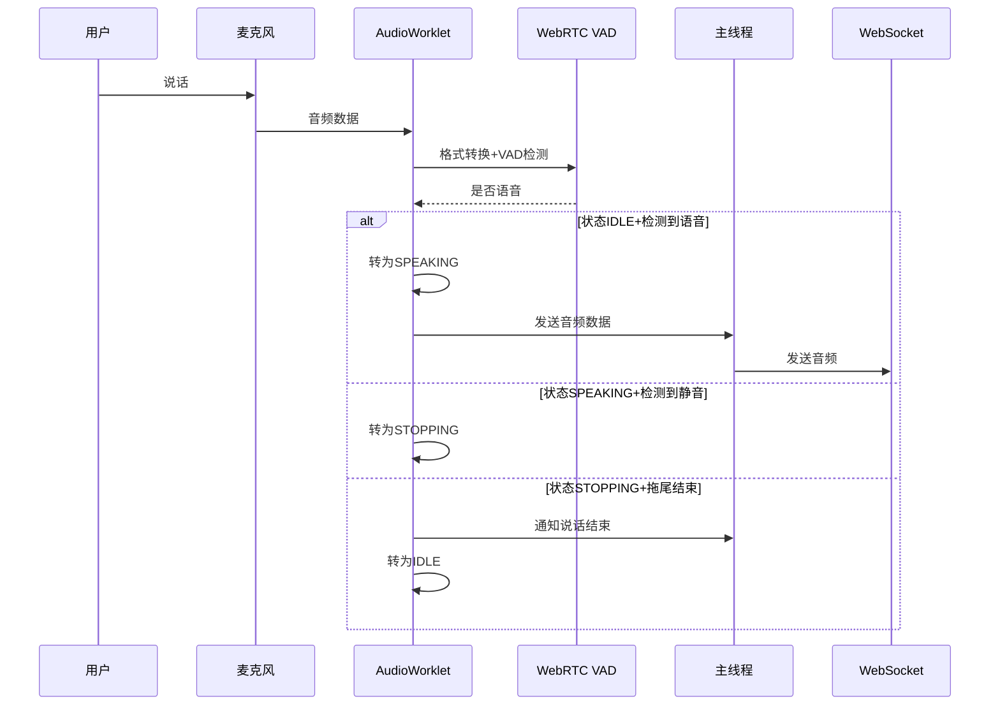

## 产品概述

在语音对话系统的前端集成 WebRTC VAD 和回声消除改进，实现智能的语音端点检测，只在检测到有效语音时才发送音频数据到后端。

## 核心功能

- 在前端使用 webrtc-vad-js 集成 WebRTC VAD，通过 Wasm 在浏览器中运行 VAD 算法
- 实现状态机管理（IDLE、SPEAKING、STOPPING）控制录音流程
- 实现拖尾处理防止吞掉尾音
- 改进回声消除，将播放音频连接到 MediaStreamDestination 提供回声参考
- 优化音频数据传输，只在检测到有效语音时才发送数据到后端

## 技术栈

- 前端框架：原生 JavaScript（ES6+）
- VAD 库：webrtc-vad-js（Wasm）
- 音频处理：AudioWorklet API
- 音频格式：Int16 PCM，16kHz 采样率

## 实现方案

### 总体策略

在 AudioWorklet 处理器中集成 webrtc-vad-js Wasm 模块，实现浏览器端实时 VAD 检测。通过状态机管理录音流程，只在检测到有效语音时才发送音频数据。同时改进回声消除，将播放音频连接到 MediaStreamDestination 提供回声参考信号。

### 关键技术决策

1. **在 AudioWorklet 中运行 VAD**

- 原因：AudioWorklet 在独立线程运行，不阻塞主线程，避免已废弃的 ScriptProcessorNode 性能问题
- 权衡：需要在 AudioWorklet 中加载 Wasm 模块，注意模块加载时机

2. **状态机设计**

- IDLE：空闲状态，等待用户开始说话
- SPEAKING：检测到语音，开始采集和发送音频
- STOPPING：检测到静音，等待拖尾时间后停止
- 原因：避免频繁开始/停止录音，提供更好用户体验

3. **拖尾处理**

- 检测到静音后继续采集 300ms 音频
- 原因：防止吞掉尾音

4. **回声消除改进**

- 创建 MediaStreamDestination 作为播放目标
- 将 TTS 播放音频连接到该目标
- 原因：提供回声参考信号，帮助浏览器回声消除算法工作

### 实现细节

#### 帧长处理

16kHz 采样率下：

- 10ms = 160 采样点
- 20ms = 320 采样点
- 30ms = 480 采样点

需要累积足够采样点后才进行 VAD 检测。

#### AudioWorklet 中 VAD 初始化

在 AudioWorklet 处理器中加载并初始化 VAD：

- 使用 import 引入 webrtc-vad-js
- 调用 vad.init() 初始化 Wasm 模块
- 设置激进模式 vad.setMode(3)

#### 音频格式转换

- 浏览器 AudioBuffer 输出 Float32Array（-1.0 到 1.0）
- WebRTC VAD 需要 Int16Array（-32768 到 32767）
- 必须进行线性量化转换

### 架构设计



### 目录结构

```
frontend/
├── index.html              [MODIFY] 引入 webrtc-vad-js 库
├── voice_interface.js      [MODIFY] 改进回声消除，修改播放目标
├── audio_worklet.js        [MODIFY] 集成VAD，实现状态机和拖尾处理
└── js/
    └── webrtc-vad-js/      [NEW] VAD Wasm 相关文件
```

### 性能考虑

- VAD 检测在 AudioWorklet 线程中进行，不阻塞主线程
- 使用 Transferable Objects 传输音频数据，避免拷贝
- 合理设置帧长和拖尾时间，平衡响应速度和准确性

### 注意事项

- webrtc-vad-js 需要正确加载 Wasm 文件，注意路径配置
- 采样率必须对齐到 16kHz
- 音频格式需要从 Float32Array 转换为 Int16Array
- 帧长必须是 10ms/20ms/30ms 的整数倍